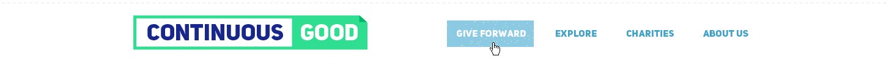
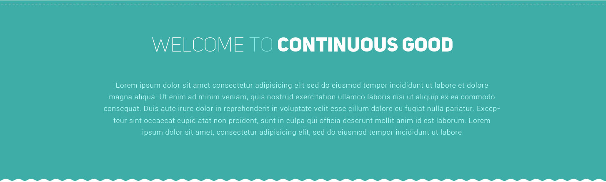

# Image to HTML
In this assignment, we will work on coding the design for Continuous Good using HTML and CSS.  

## Completing Tasks
For this assignment, you will be making changes to:  
- debugacademy-htmlcss/continuousgood/homepage.html  
- debugacademy-htmlcss/continuousgood/style.css  

**Please use SublimeText to edit the HTML and CSS files.**  

## Tasks
Open the continuousgood folder. It can be found in ./continuousgood. It contains several files that will be necessary for working on this assignment:  
- **homepage.html**: this is the HTML file you will be modifying and adding HTML code to. We have outlined where your code should be written for each section within the file by using HTML comments. You will replace the comment (the <!-- [text] -->) with your HTML for that section.  
- **style.css**: this is the CSS file you will be modifying and adding CSS code to.  
- **images**: this is a folder with images you will need as you write the html and CSS for the homepage design.  

### Full Design
This is the full design that we will be working on turning into HTML/CSS.  

  

### Code the header section
For this task, we will code this header section:  
  

#### Code the header's HTML  
Edit the file named homepage.html. The header's HTML code should replace the line that says `<!-- The header section -->`.  

The header section consists of the following elements:  
- A heading  
  - Use `<h1>` to write the site name (Continuous Good) in the header
  - This will be visually hidden later  
- A logo  
  - Use an `` tag with its `src` attribute set equal to `"images/logo.jpg"` to place the logo image  
- A `<nav>` element, which will contain the menu  
- A menu, which is a "list" of links  
  - Create a single unordered list (`<ul>`)  
  - Each list item should be placed within an `<li>` element  
  - Within each `<li>`, create a placeholder link: `<a href="#">A Link</a>`  

Save your work, then open the file continuousgood/homepage.html in your browser to see the progress.  

#### Code the header's CSS  
Now that we have our header's HTML written, we will use CSS to style and arrange it.  

- The `header` element's has a border at the top  
  - The border color is `#eeeeee`  
  - The border is not a solid line, it is dashed  
  - Also, set the header's height to `108px`
- Hide the header's `<h1>` text
- Target the `<nav>` element within the `<header>`.  
  - Set its css `float:` attribute to `right;`  
  - The menu links' background color is: #8ccae1
- There is 4px spacing above the header  
  - This can be applied using "margin" because the spacing is outside of the header  

### Code the Welcome section
For this task, we will code this hero section:  
  

#### Code the Welcome's HTML  
Edit the file named homepage.html. The welcome section's HTML code should replace the line that says `<!-- The "Welcome to Continuous Good" section -->`.  

The welcome section consists of the following elements:  
- The `<h2>` heading tag for the ("Welcome to continuous good") text  
- A `
` paragraph tag to contain the text. You can enter any placeholder text for that section.  

#### Code the welcome section's CSS  
Now that we have our welcome section's HTML written, we will use CSS to style and arrange it.  

- Set the height of the welcome div to `424px`  
- Set the section's background image to: `images/section-2-top-dotted-border.jpg`
  - The background image should *only* repeat horizontally
  - Background image aligned at the *top* of the div
  - Background color's Hex code: #3eada7
